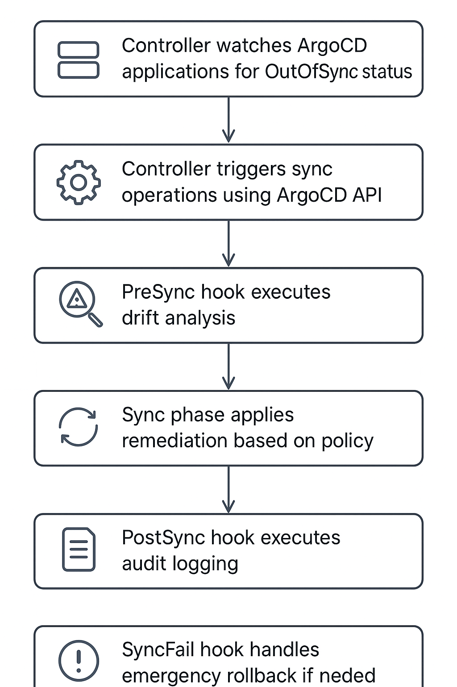

# ArgoCD Advanced Drift Detection and Auto-Remediation Demo

## Overview
This demo showcases a sophisticated drift detection and auto-remediation system for ArgoCD that combines:
- **Custom Health Checks** for real-time drift detection
- **Resource Hooks** for automated remediation workflows
- **ApplicationSet** for policy-driven application management
- **Dynamic Remediation Matrix** based on drift severity

## Architecture

```
┌─────────────────┐    ┌──────────────────┐    ┌─────────────────┐
│   ApplicationSet │───▶│ Custom Health    │───▶│ Resource Hooks  │
│   (Policy Mgmt) │    │ Checks (Detect)  │    │ (Remediate)     │
└─────────────────┘    └──────────────────┘    └─────────────────┘
                                │                        │
                       ┌─────────────────┐    ┌─────────────────┐
                       │ Drift Controller│    │ Audit & Alerts  │
                       │ (Orchestrate)   │    │ (Track & Notify)│
                       └─────────────────┘    └─────────────────┘
```

## Prerequisites

### Required Software
- Docker Desktop with Kubernetes enabled
- kubectl configured for Docker Desktop context
- ArgoCD CLI (optional, for manual operations)
- Git (for cloning the repository)

### Verify Setup
```bash
# Check Docker Desktop Kubernetes
kubectl config current-context  # Should show "docker-desktop"
kubectl get nodes               # Should show your local node

# Check available resources
kubectl top nodes               # Ensure sufficient CPU/Memory
```

## Quick Start Guide

### Step 1: Clone and Setup
```bash
git clone 
cd argo-drift-demo

# Make scripts executable
chmod +x setup/*.sh
```

### Step 2: Install ArgoCD
```bash
./setup/install-argocd.sh
```

**What this does:**
- Creates `argocd` namespace
- Installs ArgoCD with standard manifests
- Waits for ArgoCD to be ready
- Displays admin password for UI access

**Expected output:**
```
🚀 Installing ArgoCD on Docker Desktop Kubernetes...
⏳ Waiting for ArgoCD to be ready...
🔑 ArgoCD Admin Password: [generated-password]
✅ ArgoCD installed successfully!
```

### Step 3: Access ArgoCD UI (Optional)
```bash
# In a separate terminal (keep running)
kubectl port-forward svc/argocd-server -n argocd 8080:443

# Visit https://localhost:8080
# Username: admin
# Password: (from Step 2 output)
```

### Step 4: Setup Demo Environment
```bash
./setup/setup-demo.sh
```

**What this does:**
- Builds Docker images for hook containers
- Applies custom health checks to ArgoCD
- Deploys the drift detection controller
- Creates ApplicationSet with three demo applications
- Configures RBAC permissions


### Step 5: Verify Installation
```bash
# Check applications are created
kubectl get applications -n argocd

# Check controller is running
kubectl get pods -n argocd -l app=argo-drift-controller
```

## Demo Components Explained

### 1. ApplicationSet Controller
**File:** `k8s/applicationset.yaml`

Creates three applications with different drift policies:

| Application           | Severity | Auto-Remediate | Sync Policy | Hook Policy         |
|-----------------------|----------|----------------|-------------|---------------------|
| enhanced-low-app      | low      | true           | automated   | auto-sync           |
| enhanced-medium-app   | medium   | conditional    | manual      | notify-approve      |
| enhanced-high-app     | high     | immediate      | emergency   | immediate-rollback  |


**Key Features:**
- Template-based application generation
- Policy inheritance through labels
- Environment-specific configurations

### 2. Custom Health Checks
**File:** `k8s/argocd-config/custom-health-checks.yaml`

Extends ArgoCD's native health assessment:

```lua
-- Deployment drift detection
if obj.status.replicas ~= obj.spec.replicas then
  hs.status = "Progressing"
  hs.message = "Replica count drift detected"
end

-- Service drift detection  
if obj.spec.type == "LoadBalancer" then
  -- Custom logic for service changes
end
```

**Detects:**
- Replica count mismatches
- Service type changes
- Resource unavailability
- Configuration drift patterns

### 3. Resource Hooks Workflow
**Files:** `k8s/argocd-config/resource-hooks/`

Three-phase remediation workflow:

#### PreSync Hook (`presync-drift-analyzer.yaml`)
- **Wave:** -2 (runs first)
- **Purpose:** Analyze drift severity and affected resources
- **Output:** Analysis results for next phases

#### PostSync Hook (`postsync-audit-logger.yaml`)
- **Wave:** 2 (runs after sync)
- **Purpose:** Create audit trails and compliance logs
- **Output:** ConfigMaps with remediation history

#### SyncFail Hook (`syncfail-emergency-rollback.yaml`)
- **Trigger:** When sync operations fail
- **Purpose:** Execute emergency rollback procedures
- **Output:** Emergency alerts and rollback actions

### 4. Drift Detection Controller
**File:** `src/auto_remediation_controller.py`

Orchestrates the entire remediation process:

```python
# Dynamic remediation matrix
remediation_matrix = {
    'low': {'action': 'auto_sync', 'approval_required': False},
    'medium': {'action': 'notify_and_timeout', 'approval_required': True},
    'high': {'action': 'immediate_rollback', 'approval_required': False},
    'critical': {'action': 'emergency_stop', 'approval_required': False}
}
```

**Key Functions:**
- Watches ArgoCD applications for OutOfSync status
- Applies remediation policies based on severity
- Manages cooldown periods and retry logic
- Integrates with notification systems



## Live Demo Script

### Phase 1: Initial State Verification (2 minutes)

```bash
echo "=== Phase 1: Showing Initial State ==="

# Show ApplicationSet created applications
kubectl get applications -n argocd

# Show all applications are healthy
kubectl get applications -n argocd -o custom-columns=NAME:.metadata.name,HEALTH:.status.health.status,SYNC:.status.sync.status

# Show controller is monitoring
kubectl logs deployment/argo-drift-controller -n argocd --tail=5
```

### Phase 2: Low Severity Drift Demo (4 minutes)

```bash
echo "=== Phase 2: Low Severity Drift - Auto Remediation ==="

# Simulate low severity drift (replica scaling)
echo "🎯 Simulating replica count drift..."
kubectl scale deployment low-severity-app --replicas=1 -n enhanced-low-severity

```

### Phase 3: Medium Severity Drift Demo (4 minutes)

```bash
echo "=== Phase 3: Medium Severity Drift - Approval Workflow ==="

# Simulate medium severity drift (service change)
echo "🎯 Simulating service configuration drift..."
kubectl patch service medium-severity-app-service -n enhanced-medium-severity -p '{"spec":{"type":"LoadBalancer"}}'


### Phase 4: High Severity Drift Demo (3 minutes)

```bash
echo "=== Phase 4: High Severity Drift - Emergency Response ==="

# Simulate high severity drift (delete critical service)
echo "🚨 Simulating critical service deletion..."
kubectl delete service high-severity-app-service -n enhanced-high-severity
```

### Phase 5: Audit and Observability (2 minutes)

```bash
echo "=== Phase 5: Audit Trail and Observability ==="

# Show complete audit trail
echo "📊 Complete audit trail from all remediation actions..."
kubectl get configmaps -n argocd -l audit-type=drift-remediation -o custom-columns=NAME:.metadata.name,APP:.metadata.labels.app,TIMESTAMP:.metadata.labels.timestamp

# Show application status summary
echo "📈 Application status summary..."
kubectl get applications -n argocd -o custom-columns=NAME:.metadata.name,HEALTH:.status.health.status,SYNC:.status.sync.status,SEVERITY:.metadata.labels.drift-severity

# Show controller metrics
echo "📊 Controller activity logs..."
kubectl logs deployment/argo-drift-controller -n argocd --tail=10 | grep -i "info"

# Show ApplicationSet managing policies
echo "🎛️  ApplicationSet policy management..."
kubectl describe applicationset drift-managed-applicationset -n argocd | grep -A 10 "Template:"
```


## Customization

### Adding New Severity Levels
1. Update `remediation_matrix` in `src/auto_remediation_controller.py`
2. Add new severity rules in `src/drift_analyzer.py`
3. Create corresponding ApplicationSet entries
4. Update custom health checks if needed

### Integrating with External Systems
1. **Slack Integration:** Update webhook URL in `config/notification_config.yaml`
2. **PagerDuty:** Add integration key for critical alerts
3. **Monitoring:** Export metrics to Prometheus/Grafana
4. **ITSM:** Integrate with ServiceNow or Jira for approval workflows

### Production Considerations
1. **Security:** Implement proper RBAC and network policies
2. **Scalability:** Use persistent storage for audit logs
3. **Reliability:** Add circuit breakers and rate limiting
4. **Compliance:** Ensure audit logs meet regulatory requirements
